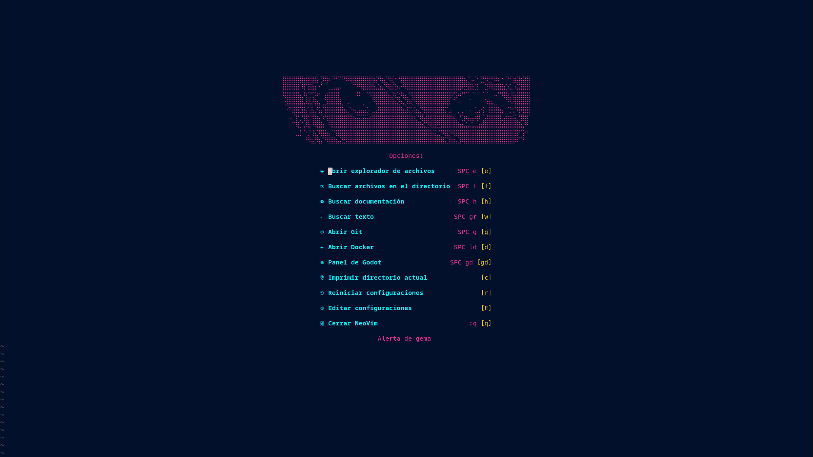
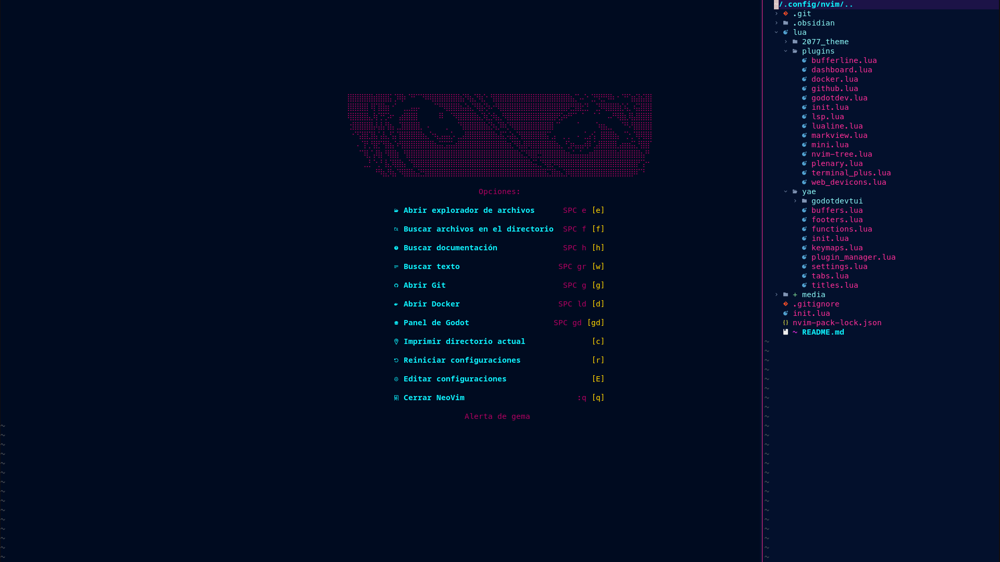
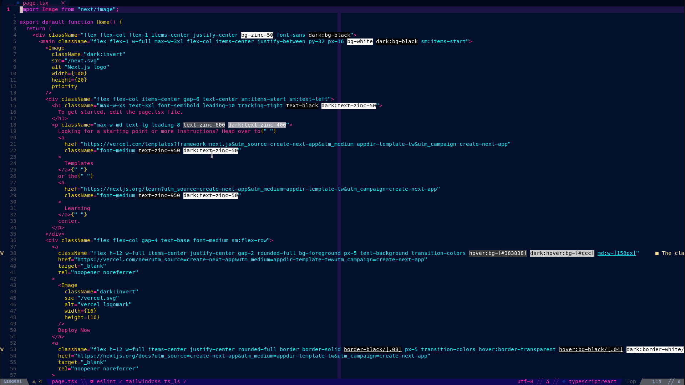

# Configuración personal de NeoVim
Configuración de NeoVim hecha con lua personalizable y extendible que proporciona una base para el desarrollo web y de videojuegos con Godot en NeoVim.
Parte del código dentro de core fue tomado de [nvim-lite](https://github.com/radleylewis/nvim-lite/tree/master).
## Características
- Integración de GitHub con LazyGit.
- Integración de Docker con LazyDocker.
- Integración de herramientas de desarrollo con Godot (en progreso).
- Gestión de LSPs a través de Mason.
- Navegación de archivos a través de Nvim-Tree.
- Navegación de pestañas similar a VSCode.
- Incluye un tema propio basado en el tema [Cyberpunk 2077](https://github.com/notKvS/2077-zed) para Zed y para [VSCode](https://github.com/endormi/vscode-2077-theme).
- Varios encabezados y pies de página incluidos.
## Requisitos
1. NeoVim >= 0.12.2.
2. LazyGit.
3. LazyDocker.
4. Una fuente de [NerdFonts](https://www.nerdfonts.com/font-downloads).
## Lista de Plugins
1. [blink.cmp](https://github.com/saghen/blink.cmp)
2. [blink.lib](https://github.com/saghen/blink.lib)
3. [bufferline.nvim](https://github.com/akinsho/bufferline.nvim)
4. [dashboard.nvim](https://github.com/nvimdev/dashboard-nvim)
5. [gitsigns.nvim](https://github.com/lewis6991/gitsigns.nvim)
6. [godotdev.nvim](https://github.com/Mathijs-Bakker/godotdev.nvim)
7. [lazydocker.nvim](https://github.com/mgierada/lazydocker.nvim)
8. [lazygit.nvim](https://github.com//kdheepak/lazygit.nvim)
9. [lualine.nvim](https://github.com//kdheepak/lazygit.nvim)
10. [markview.nvim](https://github.com/OXY2DEV/markview.nvim)
11. [mason.nvim](https://github.com/mason-org/mason.nvim) y [mason-lspconfig.nvim](https://github.com/mason-org/mason-lspconfig.nvim)
12. [mini.nvim](https://github.com/nvim-mini/mini.nvim)
13. [nvim-dap](https://github.com/mfussenegger/nvim-dap) y [nvim-dap-ui](https://github.com/rcarriga/nvim-dap-ui)
14. [nvim-lspconfig](https://github.com/neovim/nvim-lspconfig)
15. [nvim-tree.lua](https://github.com/nvim-tree/nvim-tree.lua)
16. [nvim-treesitter](https://github.com/nvim-treesitter/nvim-treesitter)
17. [nvim-ts-autotag](https://github.com/windwp/nvim-ts-autotag)
18. [nvim-web-devicons](https://github.com/nvim-tree/nvim-web-devicons)
19. [plenary.nvim](https://github.com/nvim-lua/plenary.nvim)
20. [terminal_plus.nvim](https://github.com/YBJ-UP/terminal_plus.nvim) (En desarrollo)
21. [toggleterm.nvim](https://github.com/akinsho/toggleterm.nvim)
22. [2077_theme.nvim](https://github.com/YBJ-UP/2077_theme.nvim)
# Capturas de pantalla

## Planes a futuro
- Hacer que el panel de Godot sí funcione :(.
- Integración de [atac](https://github.com/Julien-cpsn/ATAC).
- Panel de atajos de teclado.
- Gestor de plugins.
- Traducir el readme a inglés, tal vez.
- Mover el tema a su propio repositorio.